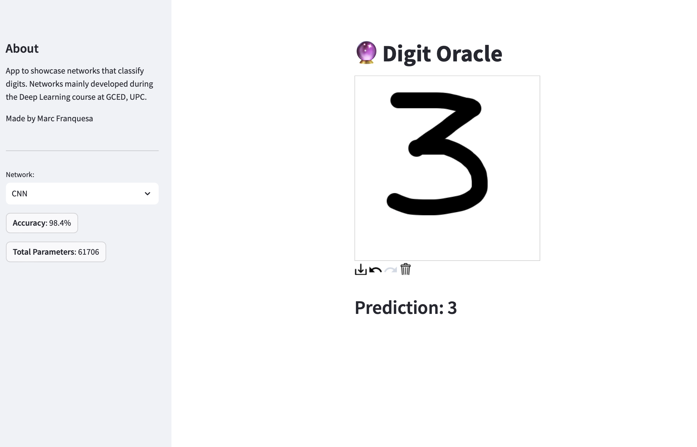

# Digit Oracle

[](https://digit-oracle.streamlit.app)

Digit Oracle is an app that predicts your number! Built to showcase what I was doing in class.

## Description
The app uses neural networks made during the [Deep Learning course](https://www.fib.upc.edu/en/studies/bachelors-degrees/bachelor-degree-data-science-and-engineering/curriculum/syllabus/AA2-GCED) at GCED, UPC to guess the number drawn. Check my labwork [here](https://github.com/marcfranquesa/gced-coursework/tree/main/AA2).

<p align="center">
  
</p>

## Training
Execute [*train.py*](src/train.py) to train the models found in [*networks*](src/networks). Parameters are defined in the [*networks.yaml*](src/networks.yaml) file. To add a new model create a new file in the [*networks*](src/networks) folder with the definition of the network. Next add the following parameters to the yaml file.
```
exampleNN:                                ---> name given
  batch_size: 64                          ---> used in training
  learning_rate: 0.0001                   ---> used in training
  log_interval: 100                       ---> used for output logging in training
  model_path: models/<model_name>.pth     ---> path to save model
  network: <file_name>.<model_name>       ---> file created followed by name of class
  num_epochs: 10                          ---> epochs in training
  test_batch_size: 64                     ---> used to compute accuracy
```

The rest of the parameters will be filled after executing the [*train.py*](src/train.py) file.

To train a single neural network run `python src/train.py <name_given>`. Running without an argument will train all models.

Using:
* [nll_loss](https://pytorch.org/docs/stable/generated/torch.nn.functional.nll_loss.html) as loss function.
* [RMSprop](https://pytorch.org/docs/stable/generated/torch.optim.RMSprop.html) as optimizer.

## Dataset
Using the *"Hello World!"* of Deep Learning [MNIST](https://en.wikipedia.org/wiki/MNIST_database).

<p align="center">
  
</p>

**Disclaimer:** the images here are of size `28x28` as well as very particular. For the app to work I rescaled the image drawn to the `28x28` and formatted to look as close as possible. The predictions are no where near perfect. The closer you draw numbers to the ones found in the dataset the better!

## References
[https://github.com/pytorch/examples/blob/master/mnist/main.py](https://github.com/pytorch/examples/blob/master/mnist/main.py)